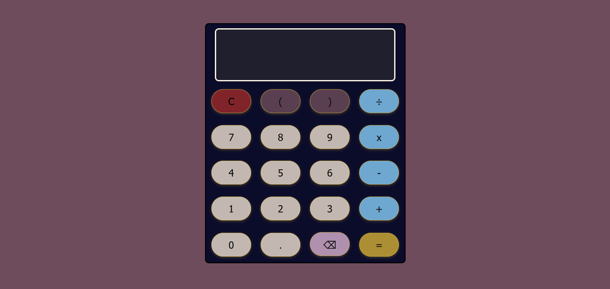

# Calculator

🧮 Simple Web Calculator

This is a basic yet fully functional web-based calculator built with HTML, CSS, and JavaScript. It allows users to perform common arithmetic operations like addition, subtraction, multiplication, and division, with support for parentheses and decimal values.

✨ Features

        1. Interactive number and operator buttons
        2. Live display of input expression
        3. Handles parentheses and decimal values
        4. Validates user input to avoid invalid expressions
        5. Displays results rounded to 4 decimal places
        6. Backspace and clear functionality
        7. Prevents consecutive or invalid operator sequences
        8. Built using plain JavaScript (no external libraries)

🚀 How to Use

    Clone or download this repository.

    Open index.html in any modern web browser.

    Use the on-screen buttons to perform calculations.

📂 File Structure

    index.html       # Main HTML file
    style.css        # Styling for calculator layout
    script.js        # JavaScript logic for calculator functionality

📸 Screenshot

🛠️ Future Improvements

    Add support for exponentiation (^)

    Keyboard input support

    Dark mode toggle

    History of calculations
